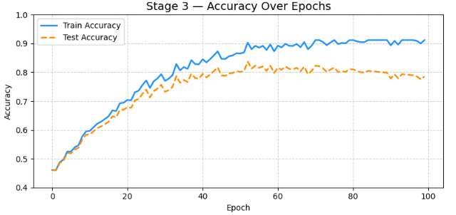
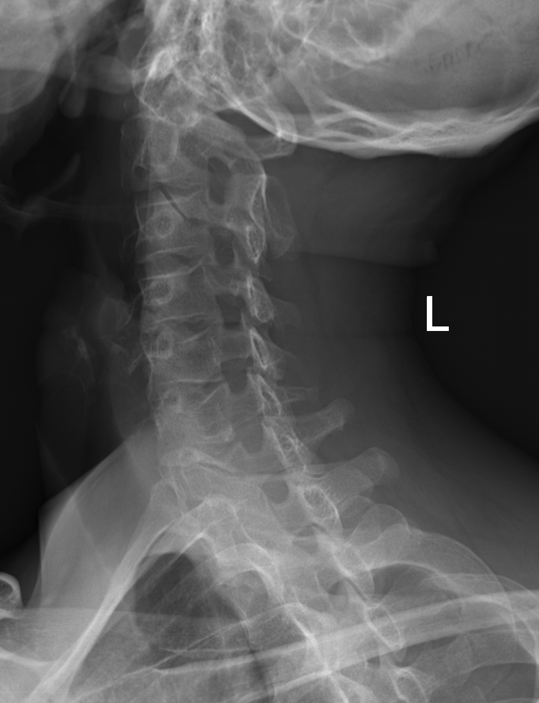
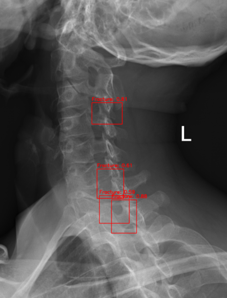
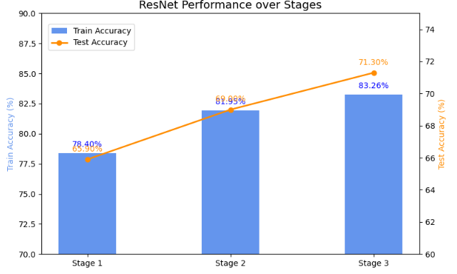
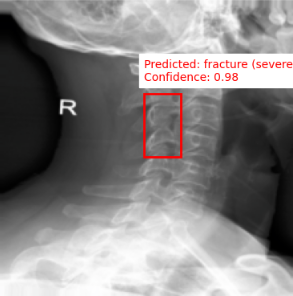
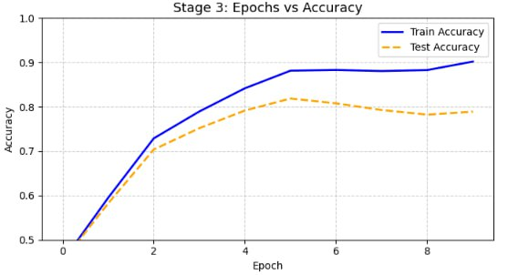
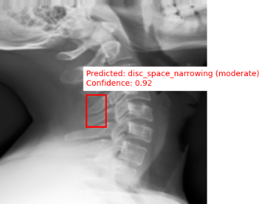
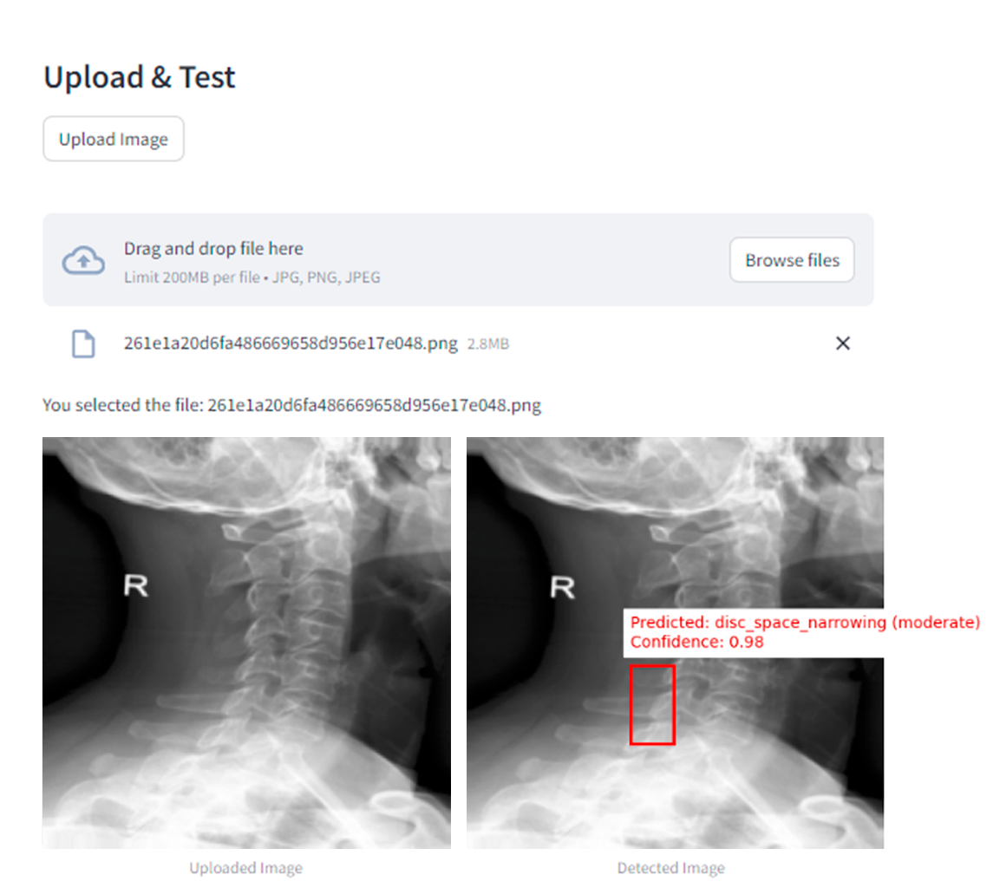

# Vertebral Compression Fracture Analysis

**Bachelor's thesis research on deep learning for vertebral compression fracture analysis in spinal X-rays using YOLOv8m, ResNet-18, and a modified U-Net encoder.**

> **Repository status — research archive.** The original experimental notebooks, trained weights, and application source code are no longer available. This repository preserves the methodology, reported experiments, figures, and visual evidence from the thesis project.

## Overview

Vertebral compression fractures (VCFs) can be difficult to identify consistently from spinal radiographs, particularly when pathological changes are subtle. This project explored complementary deep-learning approaches for localization and severity analysis of spinal abnormalities:

- **YOLOv8m** — object detection / localization of pathological regions
- **ResNet-18** — severity classification
- **Modified U-Net encoder** — severity classification using spatial feature representations

The work was completed as part of a bachelor's thesis project in **Big Data Analysis at Astana IT University**.

### My contribution

My primary technical focus was the **YOLOv8-based detection pipeline**, including data preparation, training experiments, hyperparameter tuning, and evaluation. The ResNet-18 and modified U-Net experiments are documented here as components of the broader thesis project.

## Dataset

Experiments used the public **VinDr-SpineXR** dataset described in the preserved thesis as containing **10,466 spinal X-ray images from 4,000 studies**, split into 8,389 training images and 2,077 test images. The dataset contains DICOM radiographs and radiologist annotations for 13 lesion categories, including fracture and vertebral collapse.

## Experimental pipeline

The thesis documents a workflow covering DICOM ingestion, preprocessing, augmentation, transfer learning, multi-stage model tuning, held-out evaluation, qualitative prediction review, and a Streamlit research prototype.

Preprocessing described in the thesis includes grayscale conversion, orientation alignment, empty-border removal, histogram equalization, resizing, normalization, and model-specific tensor transformations. Augmentation varied by experiment and included rotations, translations, flips, brightness/contrast transformations, HSV shifts, Mosaic, and MixUp.

## YOLOv8m — localization

YOLOv8m was investigated for localization of pathological regions in spinal radiographs. The final documented configuration used 640×640 input, 100 epochs, batch size 16, SGD with momentum 0.937, cosine annealing, pretrained weights, and simplified augmentation.

| Stage | Reported training score | Reported evaluation score |
|---|---:|---:|
| Stage 1 | 83.70% | 70.10% |
| Stage 2 | 88.40% | 75.20% |
| Stage 3 | **91.20%** | **78.60%** |

Final reported losses were **0.2153 training** and **0.5617 test**.

> Final YOLOv8m performance: **78.60% mAP**.



### Example localization

| Input | Preserved prediction |
|---|---|
|  |  |

## ResNet-18 — severity classification

ResNet-18 was trained using ImageNet-pretrained weights and transfer learning. Images were resized to 224×224 and normalized with ImageNet statistics. The thesis describes severity labels derived from diagnostic annotations and anatomical information.

| Stage | Training accuracy | Test accuracy |
|---|---:|---:|
| Stage 1 | 78.40% | 65.90% |
| Stage 2 | 81.95% | 69.00% |
| Stage 3 | **83.26%** | **71.30%** |

Final reported losses were **0.3627 training** and **0.8302 test**.





## Modified U-Net encoder — severity classification

The preserved thesis describes a model inspired by U-Net but adapted for severity classification rather than a conventional end-to-end segmentation task. It retained an encoder/bottleneck feature extractor and added a classification head for four severity levels: **none, mild, moderate, severe**.

| Stage | Training accuracy | Test accuracy |
|---|---:|---:|
| Stage 1 | 74.10% | 65.20% |
| Stage 2 | 81.30% | 72.60% |
| Stage 3 | **83.47%** | **75.80%** |

The final configuration achieved **87.50% training accuracy** and **75.80% test accuracy**.





## Final results

| Model | Task | Final result |
|---|---|---:|
| YOLOv8m | Vertebral pathology localization | **78.60% mAP** |
| Modified U-Net encoder | Severity classification | **75.80% test accuracy** |
| ResNet-18 | Severity classification | **71.30% test accuracy** |

Because YOLOv8m addresses localization while ResNet-18 and the modified U-Net address severity classification, the reported metrics describe different experimental tasks and are not intended as a direct model ranking.

## Streamlit research prototype

The thesis documents a Streamlit interface that allowed users to upload a spinal X-ray, choose an experimental model, and inspect a prediction. The application source is not preserved in this archive.



## Technology used in the original project

`Python` · `PyTorch` · `YOLOv8` · `ResNet-18` · `U-Net` · `OpenCV` · `pandas` · `NumPy` · `scikit-learn` · `matplotlib` · `Streamlit` · `Google Colab`

## Limitations and archival status

This was an undergraduate research project, not a clinically validated system. The experiments used a public dataset and were not externally validated on an independent hospital cohort. The models addressed different tasks, so their reported scores are not directly comparable.

The **original experimental notebooks, model weights, and Streamlit source code were lost after the thesis was completed**. The repository preserves selected methodology, reported results, and visual evidence from the completed thesis project.

This repository is intended as a **research archive and portfolio record**, not a reproducible benchmark or medical device.

## Repository structure

```text
.
├── README.md
└── assets/
    ├── architecture/
    ├── results/
    └── demo/
```

## Future work

A future reconstruction could rebuild the YOLOv8 detection pipeline first, establish explicit patient-level train/validation/test splits, report standard detection metrics such as mAP50 and mAP50–95, add confidence intervals and external validation, and package inference in a versioned application/API.

## Intended use

For academic and portfolio documentation only. **Not for clinical diagnosis or treatment decisions.**
